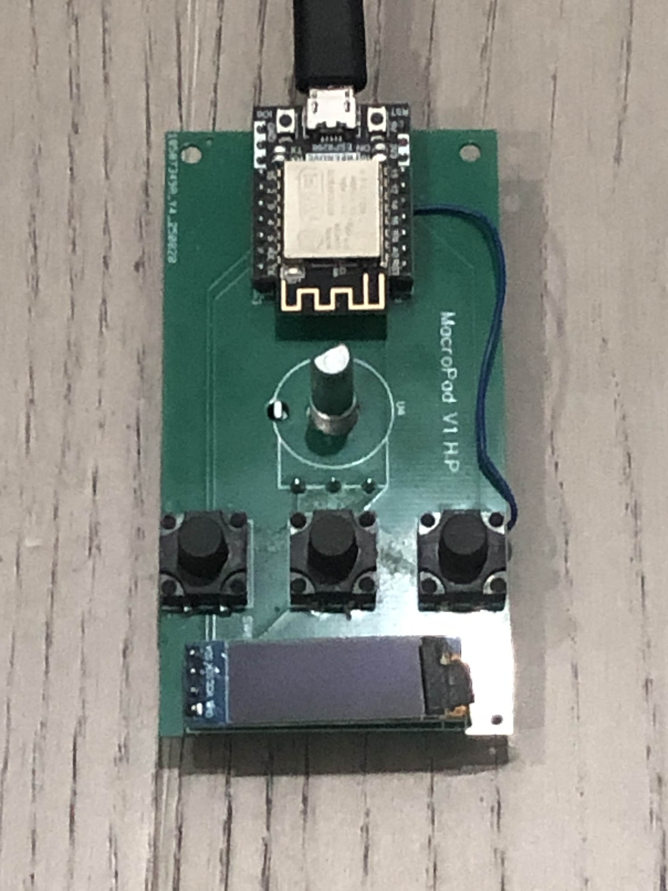

# esp8266-macropad

A simple macropad built with an **ESP8266**, an **OLED display**, a **potentiometer**, and **three buttons**.  
I designed a custom PCB to house all components and wrote C++ firmware to handle input (buttons + potentiometer) and update the OLED screen. A companion Python script runs on the host computer to trigger macros based on which button or layer is active.

---

## Features
- **Three programmable buttons** for quick actions (macros, shortcuts, etc.)
- **Potentiometer knob** for choosing macro layer
  - Can be used to directly adjust **screen brightness** or **system volume**
- **OLED display** for showing the current layer and which button was just pressed
- **Layer support**: buttons behave differently depending on active layer
- **Custom PCB** designed to fit all components neatly

---

## Work in Progress
- Designing a **custom 3D-printed enclosure** for a cleaner look and to protect the PCB

---

## Image

---

## How It Works
- **ESP8266 firmware (C++)**  
  Reads the potentiometer position and button presses, then updates the OLED with the current state.  
- **Host-side script (Python)**  
  Listens for inputs from the ESP8266 and maps them to system actions such as:
  - Launching applications
  - Sending keyboard shortcuts
  - Adjusting brightness or volume

---
